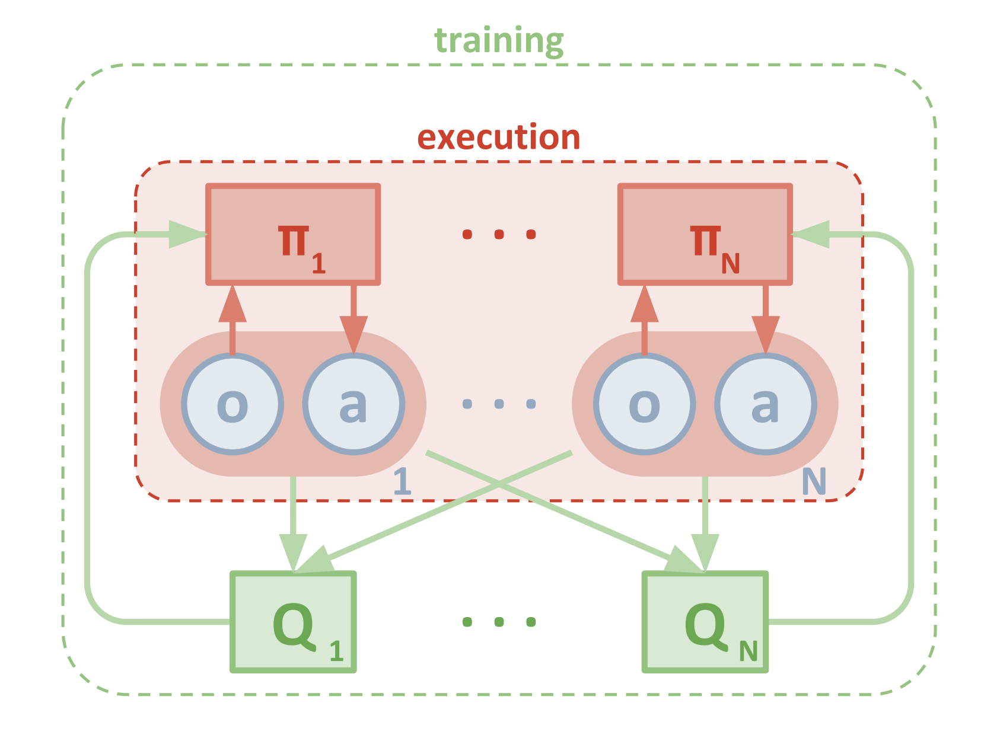

#### Udacity Deep Reinforcement Learning Nanodegree
##### &nbsp;
## Project 3: Collaboration and Competition
### Train two agents to control their rackets to bounce a ball over a net, and keep the ball in play as long as possible.


***Source: 2. The Environment - Introduction***

##### &nbsp;

## ==Project Details==

## Goal
In this [Tennis](https://github.com/Unity-Technologies/ml-agents/blob/master/docs/Learning-Environment-Examples.md#tennis) environment, two agents control rackets to bounce a ball over a net. The **goal** of each agent is to keep the ball in play.

As discovered in ***1. Start the Environment***, the **Vector Action space size** (per agent) is 2 and the **Vector Observation space size** (per agent) is 24. The **number of agents** is 2.

If an agent hits the ball over the net, it receives a reward of +0.1. If an agent lets a ball hit the ground or hits the ball out of bounds, it receives a reward of -0.01..

The task is *episodic*, and **in order to solve the environment**, the agents must get ***an average score of +0.5 (over 100 consecutive episodes, after taking the maximum over both agents)***. Specifically,

- After each episode, we add up the rewards that each agent received (without discounting), to get a score for each agent. This yields 2 (potentially different) scores. We then take the maximum of these 2 scores.
- This yields a single **score** for each episode.

The environment is **considered solved** when ***the average (over 100 episodes) of those scores is at least +0.5***.


##### &nbsp;

## ==Getting Started (with this repo)==
Load the Jupyter notebook  **`Tennis_Final.ipynb`**. 
Take note of *which* **UnityEnvironment** file_name to use, depending on whether you're running in the Udacity workspace or in an Ubuntu 18.04.2 LTS Unity environment. (If you are running on Mac OSX or Windows, there will be a different UnityEnvironment as well.)

##### &nbsp;

## ==Instructions (for running locally in Ubuntu 18.04.2 LTS)==

There is a  **`requirements.txt`** file that you can use to replicate my environment. (Make sure you also have the proper NVIDIA drivers installed if using GPU, and the correct Unity ML environment.)

##### &nbsp;

## Solution Approach
Basic steps to build an agent that solves this environment:
(These five map to the 5 steps in the file **`Tennis_Final.ipynb`**.)

1. Start the Environment
2. Examine the State and Action Spaces
3. Take Random Actions in the Environment
4. Train agent to solve the environment!
5. Test the saved agent


### 1. Start the Environment
Import the required libraries and create the UnityEnvironment . Note the **Vector Observation space size (per agent) = 24** and **Vector Action space size (per agent) = 2**.


### 2. Examine the State and Action Spaces
The state space has 24 dimensions which include the position and velocity of the ball and racket. Each agent receives its own, local observation. Two *continuous actions* are available, corresponding to **movement toward (or away from) the net**, and **jumping**.


### 3. Take Random Actions in the Environment
The following code - taken from ***3. Take Random Actions in the Environment*** of the **Collaboration and Competition** project - accomplishes this initial sanity check.

```python
for i in range(1, 6):                                      # play game for 5 episodes
    env_info = env.reset(train_mode=False)[brain_name]     # reset the environment    
    states = env_info.vector_observations                  # get the current state (for each agent)
    scores = np.zeros(num_agents)                          # initialize the score (for each agent)
    while True:
        actions = np.random.randn(num_agents, action_size) # select an action (for each agent)
        actions = np.clip(actions, -1, 1)                  # all actions between -1 and 1
        env_info = env.step(actions)[brain_name]           # send all actions to tne environment
        next_states = env_info.vector_observations         # get next state (for each agent)
        rewards = env_info.rewards                         # get reward (for each agent)
        dones = env_info.local_done                        # see if episode finished
        scores += env_info.rewards                         # update the score (for each agent)
        states = next_states                               # roll over states to next time step
        if np.any(dones):                                  # exit loop if episode finished
            break
    print('Score (max over agents) from episode {}: {}'.format(i, np.max(scores)))
```

Running the agent several times produced scores of **0.0** or something small like **0.090**. This step is just to ensure that the environment works and that we are ready to try our solution.

##### &nbsp;

## ==Learning Algorithm==
The algorithm used is **Multi-Agent Deep Deterministic Policy Gradients (MADDPG)**.

The final hyper-parameters used were as follows (n_episodes=2000, max_t=1000).

```python
BUFFER_SIZE = int(1e6)  # replay buffer size
BATCH_SIZE = 128        # minibatch size
LR_ACTOR = 1e-3         # learning rate of the actor
LR_CRITIC = 1e-3        # learning rate of the critic
WEIGHT_DECAY = 0        # L2 weight decay
LEARN_EVERY = 10        # learning timestep interval
LEARN_NUM = 5           # number of learning passes
GAMMA = 0.99            # discount factor
TAU = 8e-3              # for soft update of target parameters
OU_SIGMA = 0.2          # Ornstein-Uhlenbeck noise parameter, volatility
OU_THETA = 0.15         # Ornstein-Uhlenbeck noise parameter, speed of mean reversion
EPS_START = 5.0         # initial value for epsilon in noise decay process in Agent.act()
EPS_EP_END = 300        # episode to end the noise decay process
EPS_FINAL = 0           # final value for epsilon after decay
```


### 4. Train agent to solve the environment!

Here is a network diagram of MADDPG. [Source](https://medium.com/brillio-data-science/improving-openai-multi-agent-actor-critic-rl-algorithm-27719f3cafd4) 

This diagram depicts the multi-agent decentralized actor, centralized critic approach (from openAI paper)



##### &nbsp;

The following sections describe important concepts related to the **MADDPG** algorithm.

#### Policy-Based vs. Value-Vased Methods
There are two key differences between this project's [Tennis](https://github.com/Unity-Technologies/ml-agents/blob/master/docs/Learning-Environment-Examples.md#tennis) environment and the first project's [Banana Collector](https://github.com/Unity-Technologies/ml-agents/blob/master/docs/Learning-Environment-Examples.md#banana-collector)  environment.:
1. **Multple agents** &mdash; The **Tennis** environment has 2 agents, while the Navigation project had a single agent. 
2. **Continuous action space** &mdash; The action space is now _continuous_, which allows each agent to execute more complex and precise movements. Essentially, there's an unlimited range of possible action values to control the racket's movement toward (or away from) the net, and jumping, whereas the agent in the Navigation project was limited to four _discrete_ actions: forward, backward, left, right.

Given the complexity of this environment, the **value-based method** we used in the first project - the **Deep Q-Network (DQN)** algorithm - is not suitable. We need an algorithm that allows the agents' rackets to utilize its full range of movement. We'll need to explore a different class of algorithms called **policy-based methods**.

Some advantages of policy-based methods:
- **Continuous action spaces** &mdash; Policy-based methods are well-suited for continuous action spaces.
- **Stochastic policies** &mdash; Both value-based and policy-based methods can learn deterministic policies. However, policy-based methods can also learn true stochastic policies.
- **Simplicity** &mdash; Policy-based methods directly learn the optimal policy, without having to maintain a separate value function estimate. With value-based methods, the agent uses its experience with the environment to maintain an estimate of the optimal action-value function, from which an optimal policy is derived. This intermediate step requires the storage of lots of additional data since you need to account for all possible action values. Even if you discretize the action space, the number of possible actions can be quite high. For example, if we assumed only 10 degrees of freedom for both joints of our robotic arm, we'd have 1024 unique actions (2<sup>10</sup>). Using DQN to determine the action that maximizes the action-value function within a continuous or high-dimensional space requires a complex optimization process at every timestep.

#### Deep Deterministic Policy Gradient (DDPG)
The **DDPG** algorithm is outlined in [this paper](https://arxiv.org/pdf/1509.02971.pdf), _Continuous Control with Deep Reinforcement Learning_, by researchers at Google Deepmind. In this paper, the authors present "a model-free, off-policy actor-critic algorithm using deep function approximators that can learn policies in high-dimensional, continuous action spaces." They highlight that DDPG can be viewed as an extension of Deep Q-learning for continuous tasks.

An algorithm suitable for the ***competitive-collaborative agents*** in the **Tennis** environment is discussed in [this paper](https://papers.nips.cc/paper/7217-multi-agent-actor-critic-for-mixed-cooperative-competitive-environments.pdf), _Multi-Agent Actor-Critic for Mixed Cooperative-Competitive Environments_, by Lowe and Wu, along with other researchers from OpenAI, UC Berkeley, and McGill University. This algorithm is called **Multi-Agent Deep Deterministic Policy Gradients** (**MADDPG**).

***See*** a diagram of **MADDPG** shown above.

###### &nbsp;

#### Why MADDPG?
As in **DDPG** we use **Actor-Critic** networks, but instead of training each agent to learn from its own action, we incorporate actions taken *by all agents*. Why do this? The environment state depends on the actions taken by all agents so if we train an agent using just its own action, the policy network does not get enough information to come up with a good policy and most likely will take longer to find any good policy. In summary, **MADDPG** improves upon DDPG in that we now share the actions taken **by all agents** to train each agent.

###### &nbsp;

#### Actor-Critic Method
Actor-critic methods leverage the strengths of both policy-based and value-based methods.

Using a policy-based approach, the agent (actor) learns how to act by directly estimating the optimal policy and maximizing reward through gradient ascent. Meanwhile, employing a value-based approach, the agent (critic) learns how to estimate the value (i.e., the future cumulative reward) of different state-action pairs. Actor-critic methods combine these two approaches in order to accelerate the learning process. Actor-critic agents are also more stable than value-based agents, while requiring fewer training samples than policy-based agents.

You can find the actor-critic logic implemented in the file **`maddpg_agent.py`**. The actor-critic models can be found via their respective **`Actor()`** and **`Critic()`** classes in **`models.py`**.

In the algorithm, local and target networks are implemented separately for both the actor and the critic.

```python
        # Actor Network (w/ Target Network)
        self.actor_local = Actor(state_size, action_size, random_seed).to(device)
        self.actor_target = Actor(state_size, action_size, random_seed).to(device)
        self.actor_optimizer = optim.Adam(self.actor_local.parameters(), lr=LR_ACTOR)

        # Critic Network (w/ Target Network)
        self.critic_local = Critic(state_size, action_size, random_seed).to(device)
        self.critic_target = Critic(state_size, action_size, random_seed).to(device)
        self.critic_optimizer = optim.Adam(self.critic_local.parameters(), lr=LR_CRITIC, weight_decay=WEIGHT_DECAY)
```

#### Exploration vs Exploitation
One challenge is choosing which action to take while the agent is still learning the optimal policy. Should the agent choose an action based on the rewards observed thus far? Or, should the agent try a new action in hopes of earning a higher reward? This is known as the **exploration-exploitation dilemma**.

In the Navigation project, this is addressed by implementing an **𝛆-greedy algorithm**. This algorithm allows the agent to systematically manage the exploration vs. exploitation trade-off. The agent "explores" by picking a random action with some probability epsilon `𝛜`. Meanwhile, the agent continues to "exploit" its knowledge of the environment by choosing actions based on the deterministic policy with probability (1-𝛜).

However, this approach won't work for controlling a robotic arm. The reason is that the actions are no longer a discrete set of simple directions (i.e., forward, backward, left, right). The actions driving the movement of the arm are forces with different magnitudes and directions. If we base our exploration mechanism on random uniform sampling, the direction actions would have a mean of zero, in turn cancelling each other out. This can cause the system to oscillate without making much progress.

Instead, we'll use the **Ornstein-Uhlenbeck process**, as suggested in the previously mentioned [paper by Google DeepMind](https://arxiv.org/pdf/1509.02971.pdf) (see bottom of page 4). The Ornstein-Uhlenbeck process adds a certain amount of noise to the action values at each timestep. This noise is correlated to previous noise, and therefore tends to stay in the same direction for longer durations without canceling itself out. This allows the arm to maintain velocity and explore the action space with more continuity.

You can find the Ornstein-Uhlenbeck process implemented in the **`OUNoise`** class in **`maddpg_agent.py`**.

In total, there are five hyperparameters related to this noise process.

The Ornstein-Uhlenbeck process itself has three hyperparameters that determine the noise characteristics and magnitude:
- mu: the long-running mean
- theta: the speed of mean reversion
- sigma: the volatility parameter

The final noise parameters were set as follows:

```python
OU_SIGMA = 0.2          # Ornstein-Uhlenbeck noise parameter, volatility
OU_THETA = 0.15         # Ornstein-Uhlenbeck noise parameter, speed of mean reversion
EPS_START = 5.0         # initial value for epsilon in noise decay process in Agent.act()
EPS_EP_END = 300        # episode to end the noise decay process
EPS_FINAL = 0           # final value for epsilon after decay
```

#### Experience Replay
Experience replay allows the RL agent to learn from past experience.

DDPG/MADDPG also utilizes a replay buffer to gather experiences from each agent. Each experience is stored in a replay buffer as the agent interacts with the environment. In this project, there is one central replay buffer utilized by both agents, therefore allowing them to learn from each others' experiences.

The replay buffer contains a collection of experience tuples with the state, action, reward, and next state `(s, a, r, s')`. Each agent samples from this buffer as part of the learning step. Experiences are sampled randomly, so that the data is uncorrelated. This prevents action values from oscillating or diverging catastrophically, since a naive algorithm could otherwise become biased by correlations between sequential experience tuples.

Also, experience replay improves learning through repetition. By doing multiple passes over the data, our agents have multiple opportunities to learn from a single experience tuple. This is particularly useful for state-action pairs that occur infrequently within the environment.

#### Neural Network
As implemented in the file **`model.py`**, the  **Actor** consists of three (3) fully-connected (**Linear**) layers. The **input to fc1 is state_size**, while the **output of fc3 is action_size**. There are **256 and 128 hidden units** in fc1 and fc2, respectively, and **ReLU activation is applied to fc1 and fc2**, while **tanh is applied to fc3**. 

Similarly, the  **Critic** consists of three (3) fully-connected (**Linear**) layers. There are also **256 and 128 hidden units** in fcs1 and fc2, respectively, and **ReLU activation is applied to fcs1 and fc2**. In contrast, *nothing* is applied  **fc3**.

##### &nbsp;

**NOTE**: The files **`maddpg_agent.py`** and **`model.py`** were *based on* the **Deep Deterministic Policy Gradients (DDPG)** Coding Exercise in **3. Policy-Based Methods, Lesson 5. Actor-Critic Methods.** Specificially, from **DDPG.ipynb** running the **'BipedalWalker-v2'** gym environment.

##### &nbsp;

## ==Plot of Rewards==

The best result (MADDPG) from Step 4 was an agent (technically, two agents) able to solve the environment ***in 557 episodes!***.


##### &nbsp;

## ==Ideas for Future Work==

###### &nbsp;
In **5. Benchmark Implementation**, you can read the following two paragraphs:

 **Some Hints**
```python
Since you are well on your way to mastering deep reinforcement learning, we will not provide too many hints for this project. 
That said, in our solution code, we decided to start with the DDPG code to solve this project. To adapt it to train multiple agents, 
we first noted that **each agent receives its own, local observation**. Thus, we can easily adapt the code to simultaneously train 
both agents through self-play. In our case, each agent used the same actor network to select actions, and the experience was added 
to a shared replay buffer.
```

**Note**
```python
Note that due to the multi-agent nature of this problem, you are likely to experience a bit of instability during training. ...
```

##### &nbsp;
While working on this (last) project, I took note and actually followed the hint on basing the solution on the DDPG code, specifically from the **'BipedalWalker-v2'** DDPG coding exercise.

And sure enough, I experienced this "instability". In many diffent training runs, the variance in the number of episodes to solve the environment ranged from 557 (***this submission***) to sometimes over 700!

It is in this light that I want to explore the following:


1. Research and implement/apply *stability improvements* on the current **MADDPG** model I used in this project and see if I can actually reduce the variance in the number of episodes to solve the environment (between training runs).
2. Research and try other Multi-Agent Reinforcement Learning (**MARL**) algorithms. Working on this project and the optional **Play Soccer** challenge, I realized there is so much to learn and experiment on regarding **RL/DRL** and specifically **MARL**. I am really fascinated - actually, ***hooked*** - on this, and really plan on reading/studying and trying related research papers and their implementation in PyTorch - ***in the next 45 days***.
3. Try the **(Optional) Challenge: Play Soccer**. Currently ***in progress!*** The challenge with this optional challenge (*no pun intended!*) is that training takes a VERY LONG time :-( I trained my first model, and it didn't converge after 8+ hours and 15,000 episodes. And this is on a Ubuntu 18.04.2 LTS partition on a really fast Samsung SSD, 48GB RAM, and 8GB GTX 1070 GPU. 

BUT, I am not stopping until I get to solve this challenge. (***The trained team has been successfully trained when it scores a goal and wins 100 consecutive games.***)


###### &nbsp;
##### &nbsp;

---

# Project Starter Code
The project starter code can be found below, in case you want to run this project yourself.

Also, the original Udacity repository for this project can be found [here](https://github.com/udacity/deep-reinforcement-learning/tree/master/p3_collab-compet).


## ==Getting Started==

1. Download the environment from one of the links below.  You need only select the environment that matches your operating system:
    - Linux: [click here](https://s3-us-west-1.amazonaws.com/udacity-drlnd/P3/Tennis/Tennis_Linux.zip)
    - Mac OSX: [click here](https://s3-us-west-1.amazonaws.com/udacity-drlnd/P3/Tennis/Tennis.app.zip)
    - Windows (32-bit): [click here](https://s3-us-west-1.amazonaws.com/udacity-drlnd/P3/Tennis/Tennis_Windows_x86.zip)
    - Windows (64-bit): [click here](https://s3-us-west-1.amazonaws.com/udacity-drlnd/P3/Tennis/Tennis_Windows_x86_64.zip)

2. Place the file in the DRLND GitHub repository, in the `p3_collab-compet/` folder, and unzip (or decompress) the file.

## ==Instructions==

Follow the instructions in `Tennis.ipynb` to get started with training your own agent!  
